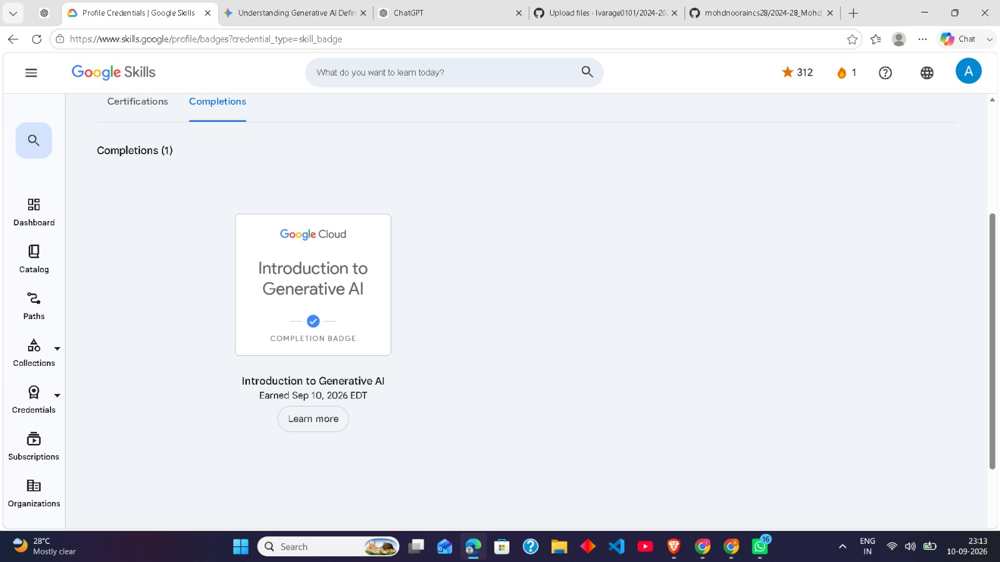

## Overview

This repository contains my Artificial Intelligence and Machine Learning
learning work, certification evidence, and related project documentation.

## Google Cloud Credential

### Introduction to Generative AI

I completed the **Introduction to Generative AI** course on Google Skills
and earned the official **Google Cloud Completion Badge** on September 10, 2026.

- **Provider:** Google Cloud
- **Course:** Introduction to Generative AI
- **Credential:** Completion Badge
- **Duration:** 45 minutes
- **Completion Date:** September 10, 2026

## Topics Covered

- Introduction to Generative AI
- Generative AI applications
- Generative AI and traditional Machine Learning
- Large Language Models
- AI and Machine Learning fundamentals
- Google AI tools

## Credential Evidence

The completion badge is included in this repository as evidence of course completion.

## Author

**Ankit Tiwari**

Computer Science and Engineering
